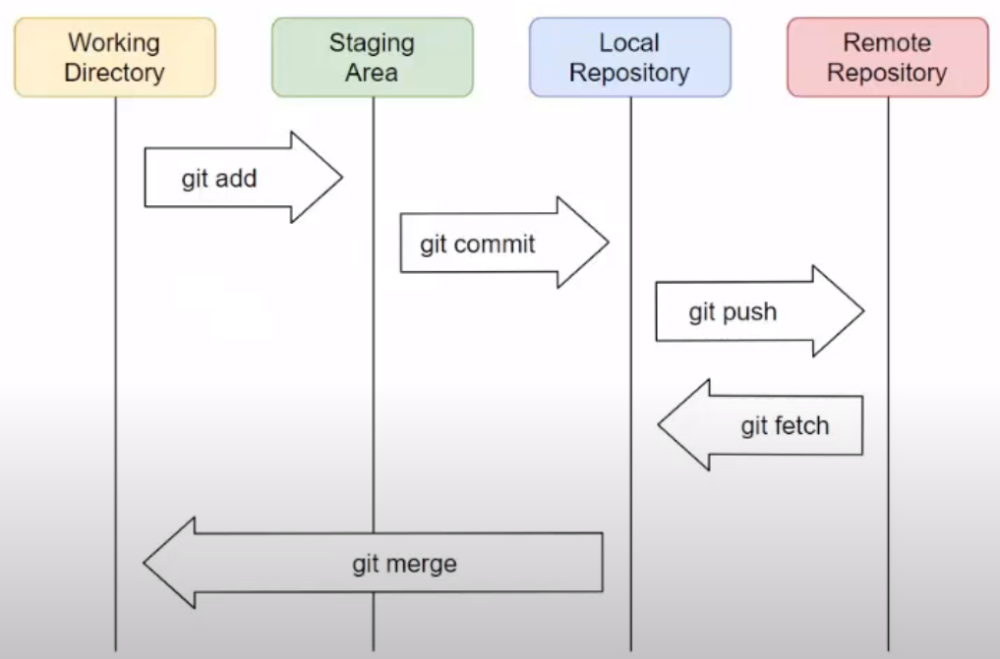

### Git Bash 명령어 정리

#### 1. 기본적인 명령어

- `Ctrl + L`: 화면 초기화
- `LS`: 목록 보기
- `cat 파일이름`: 파일의 내용 보기
  - cat Git_Bash
-  `grep`: 특정 문자를 검색
  - 추후 공부할 예정
- `cd 디렉터리 이름`: 해당 디렉터리로 이동
- `md 이름` 또는 `mkdir 이름`:  '이름' 의 디렉터리 생성
- `rm 이름`: 파일 또는 디렉터리 삭제
- `touch 파일 이름`: 파일 생성

- `vim 파일이름`: 해당 파일 내용 편집

 

#### 2. 깃 커밋 명령어

- `git init`: 현재 디렉토리를 git으로 버전관리 시작하기

- `git clone github_repository주소`:  git으로 버전관리 되는 디렉토리에서 명령 실행 시 gib hub와 연동
  - ex) `git clone https://github.com/HibernationNo1/TIL.git`
  - 로컬에서의 git init에 해당되는 명령어
  
- `git status`: Working Directory 버전관리 상태 확인하기

- `git add 파일명`: Working Directory에서 Staging Area로 이동

  - `git add Study_Git_bash.md` 파일 형식도 써야함

- `git commit` : Staging Area에 있는 데이터만 Local Repository로 commit

  - 실제 사용 -> `git commit -m "커밋 내용"`

  - `git reset 파일명`: Staging Area에서 제외시키는 명령어

- `git push`: Local Repository에서 Remote Repository(github)로 업로드

- `git fetch`: Remote Repository에서 Local Repository로 파일 정보 전달

- `git merge`: Local repository에서 Working Directory로 업로드

- `git pull`: 'git fetch'와 'git merge'가 한 번에 이루어짐

    

- `git restore 파일명`: 이전 변경사항 취소
  - 파일 내용을 추가했다가 해당 명령어 사용해서 잃어버린 내용은 복구 불가능
  - 가능하면 파일을 실수로 지워버렸을 때 되찾는 용도로 활용할 것
  
- `git --amend`: 명령어를 잘 못 입력했을 때 해당 내용을 수정 